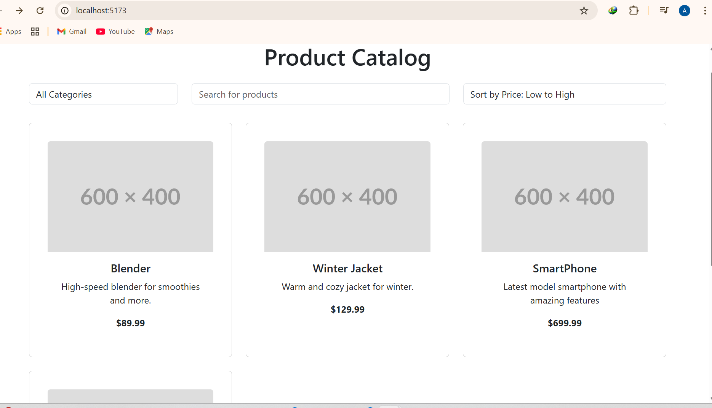
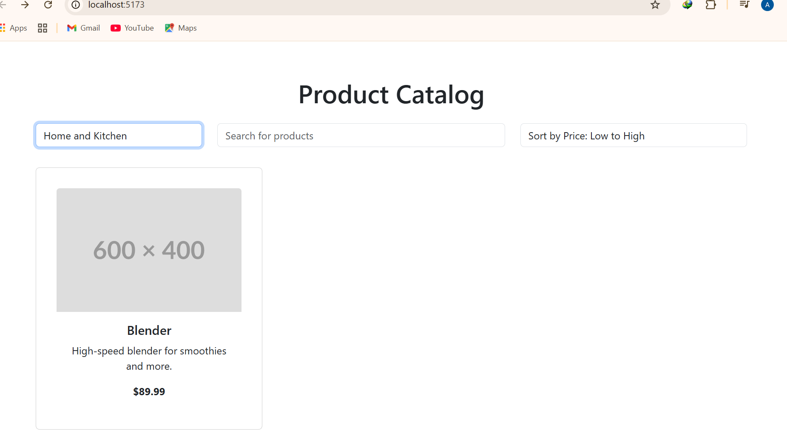
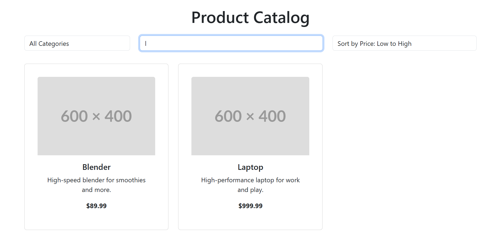

# Product Catalog — Demo

A small demo product catalog application with a Spring Boot REST API backend and a React (Vite) frontend. This README is intended for end users and contributors: it explains what the project does, how to run it locally, and where to find screenshots and configuration templates.

---

## Overview

- Backend: Spring Boot REST API serving `products` and `categories` endpoints.
- Frontend: React (Vite) that consumes the API and displays a simple storefront with category filtering.

This project is a demonstration of a full-stack Java + React application and is intended for learning or small demos.

---

## Tech Stack

- Java 17+, Spring Boot, Spring Data JPA, Hibernate
- MySQL (recommended) or any JDBC-compatible database
- React + Vite, JavaScript, CSS
- Maven (backend), npm (frontend)

---

## Quick Start (for end users)

### Prerequisites

- JDK 17+
- Node.js + npm
- MySQL (or change backend config to H2 for quick testing)

### Clone and prepare

```bash
git clone https://github.com/your-username/your-repo.git
cd your-repo
```

### Backend

1. Create a MySQL database named `product-catalog` (or choose another name and update config).
2. Copy the example config and fill your credentials:

```powershell
copy productcatalog\src\main\resources\application.properties.example productcatalog\src\main\resources\application.properties
# Edit productcatalog/src/main/resources/application.properties and set DB credentials
```

3. Run the backend:

```powershell
cd productcatalog
mvnw.cmd clean package
mvnw.cmd spring-boot:run
```

The backend will run at `http://localhost:8080`.

### Frontend

1. Install dependencies and run dev server:

```bash
cd ecom-catalog-react
npm install
npm run dev
```

2. Open `http://localhost:5173` in your browser. The frontend expects the backend at `http://localhost:8080`.

---

## API Endpoints

- `GET /api/categories` — list categories
- `GET /api/products` — list all products
- `GET /api/products/category/{categoryId}` — products filtered by category

---


## Screenshots

Place screenshots in `docs/screenshots/` and reference them here. Replace the placeholders below with actual images.

Home / Product list:


Category filter active:


Product card:


To capture screenshots:
- Windows: use Snipping Tool or Snip & Sketch and save PNGs to `docs/screenshots/`.
- macOS: `Cmd+Shift+4` and move images to `docs/screenshots/`.

---


**Security note:** Do not commit `application.properties` with real passwords. Use `application.properties.example` and keep real credentials local or in environment variables.

---

## Contributing

- Fork the repo, create a feature branch, open a PR with a description and screenshots.
- Keep secrets out of commits.

## License

Specify your project's license here (e.g., MIT).

---

If you want, I can:
- create a `docs/screenshots/` folder and add placeholder images,
- add a root `.gitignore` covering both backend and frontend,
- add `application.properties.example` if missing,
- or initialize and push the repo to GitHub (you'll need to authenticate).

